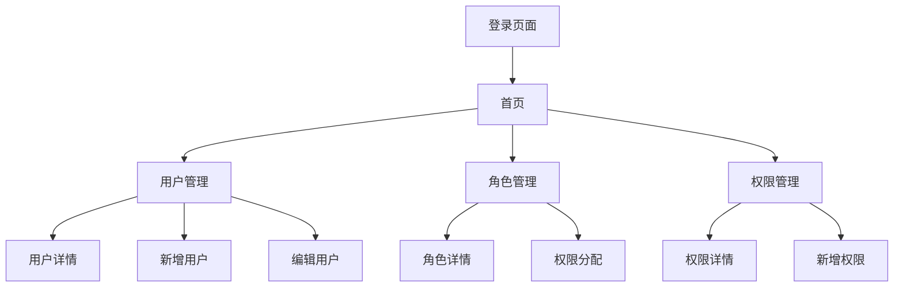

## 1. Product Overview

基于React + TypeScript + Ant Design的现代化B端管理系统，提供完整的用户认证、系统管理和数据展示功能。

系统主要解决企业内部用户管理、角色权限分配和系统配置等核心业务需求，面向管理员和系统操作人员使用。

目标打造一个功能完善、界面美观、操作便捷的企业级管理平台，提升管理效率和用户体验。

## 2. Core Features

### 2.1 User Roles

| Role | Registration Method | Core Permissions |
|------|---------------------|------------------|
| 管理员 | 系统预设账号 | 完整的系统管理权限，包括用户、角色、权限管理 |
| 普通用户 | 管理员创建分配 | 基础功能访问权限，查看个人信息和部分数据 |

### 2.2 Feature Module

我们的B端管理系统包含以下主要页面：

1. **登录页面**: 用户认证表单，记住密码功能
2. **首页**: 数据统计概览，快捷操作入口，最近活动展示
3. **用户管理页面**: 用户列表展示，用户信息CRUD操作，搜索筛选功能
4. **角色管理页面**: 角色列表管理，权限分配，角色用户关联
5. **权限管理页面**: 权限树形结构，权限类型管理，父子权限关联

### 2.3 Page Details

| Page Name | Module Name | Feature description |
|-----------|-------------|---------------------|
| 登录页面 | 认证表单 | 用户名密码输入验证，记住密码选项，登录状态管理，错误提示显示 |
| 登录页面 | 页面布局 | 全屏渐变背景，居中白色卡片，响应式设计，品牌标识展示 |
| 首页 | 欢迎信息 | 用户问候语显示，当前日期时间，系统运行状态指示 |
| 首页 | 数据统计 | 总用户数统计，在线用户数量，系统角色数量，权限总数展示 |
| 首页 | 快捷操作 | 用户管理入口，角色管理入口，权限管理入口，系统设置链接 |
| 首页 | 最近活动 | 用户操作日志，活动时间显示，操作类型标签，用户头像展示 |
| 用户管理页面 | 搜索筛选 | 用户名搜索，角色筛选，状态筛选，高级搜索选项 |
| 用户管理页面 | 用户列表 | 用户信息表格展示，分页功能，排序功能，批量操作支持 |
| 用户管理页面 | 用户操作 | 新增用户表单，编辑用户信息，删除用户确认，查看用户详情 |
| 角色管理页面 | 角色列表 | 角色信息展示，用户数量统计，角色状态管理，创建时间显示 |
| 角色管理页面 | 权限分配 | 权限多选框，权限树形结构，权限保存更新，权限预览功能 |
| 角色管理页面 | 角色操作 | 新增角色表单，编辑角色信息，删除角色确认，角色复制功能 |
| 权限管理页面 | 权限树形 | 树形结构展示，父子权限关联，权限层级管理，展开折叠功能 |
| 权限管理页面 | 权限类型 | 菜单权限标识，按钮权限标识，API权限标识，权限类型筛选 |
| 权限管理页面 | 权限操作 | 新增权限表单，编辑权限信息，删除权限确认，权限代码验证 |

## 3. Core Process

**管理员操作流程**：
管理员登录系统后，首先查看首页数据统计和系统状态。然后可以进入用户管理模块，查看用户列表，搜索特定用户，新增或编辑用户信息。在角色管理中，管理员可以创建新角色，为角色分配权限，管理角色与用户的关联关系。在权限管理中，可以查看权限树形结构，新增或修改权限配置。

**普通用户操作流程**：
普通用户登录后主要查看首页信息，了解系统状态和个人相关数据。根据分配的权限，可能可以查看部分用户信息或执行有限的操作功能。

## 4. User Interface Design

### 4.1 Design Style

- **主色调**: #1890ff (Ant Design蓝色)，#52c41a (成功绿色)
- **按钮样式**: 圆角按钮，6px圆角，支持多种尺寸
- **字体**: 14px正文，24px/20px/16px标题层级，字重500/400
- **布局风格**: 卡片式布局，左侧导航+顶部标题栏+主内容区
- **图标风格**: Ant Design Icons + Lucide React，线性图标风格

### 4.2 Page Design Overview

| Page Name | Module Name | UI Elements |
|-----------|-------------|-------------|
| 登录页面 | 整体布局 | 全屏渐变背景(135deg, #667eea 0%, #764ba2 100%)，居中白色卡片(400px宽)，阴影效果 |
| 登录页面 | 表单组件 | 大尺寸输入框，主色调按钮，记住密码复选框，错误提示文字 |
| 首页 | 统计卡片 | 白色背景，彩色图标，数值突出显示，趋势箭头指示 |
| 首页 | 快捷操作 | 3x1网格布局，图标+标题+描述，悬停效果，点击跳转 |
| 用户管理 | 搜索区域 | 白色卡片背景，搜索框+筛选器+操作按钮，16px间距 |
| 用户管理 | 数据表格 | 居中对齐，状态标签，操作按钮组，分页组件 |
| 角色管理 | 权限分配 | 树形多选框，权限类型标签，保存按钮，预览功能 |
| 权限管理 | 权限树形 | 可展开树形结构，权限类型图标，层级缩进，操作按钮 |

### 4.3 Responsiveness

系统采用桌面优先的响应式设计，主要适配≥1200px桌面端，基本适配768px-1199px平板端。在移动端(<768px)侧边栏自动折叠，表格支持横向滚动，卡片布局自动堆叠显示。支持触摸交互优化，确保在不同设备上的良好用户体验。