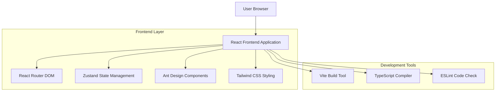
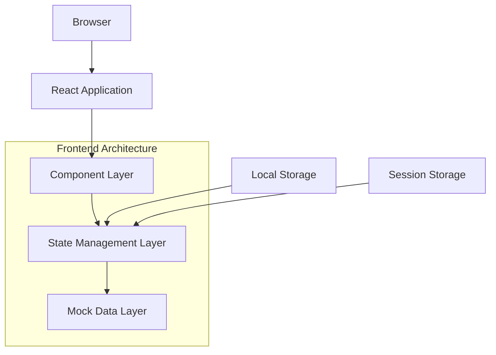
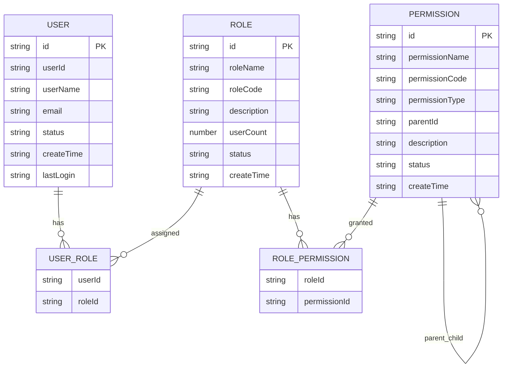

## 1. Architecture design



## 2. Technology Description

- Frontend: React@18.3.1 + TypeScript@5.8.3 + Vite@6.3.5
- UI Library: Ant Design@5.26.7 + @ant-design/icons@6.0.0 + lucide-react@0.511.0
- Styling: Tailwind CSS@3.4.17 + clsx@2.1.1 + tailwind-merge@3.0.2
- Routing: React Router DOM@7.7.1
- State Management: Zustand@5.0.3
- Charts: echarts@5.5.1
- Notifications: sonner@2.0.2
- Development: ESLint@9.25.0 + PostCSS@8.5.3 + Autoprefixer@10.4.21
- Backend: None (本地模拟数据)

## 3. Route definitions

| Route | Purpose |
|-------|----------|
| /login | 登录页面，用户身份认证和登录状态管理 |
| / | 首页，显示系统概览、数据统计和快捷操作 |
| /system | 系统管理主页，系统管理功能导航入口 |
| /system/users | 用户管理页面，用户信息的增删改查操作 |
| /system/roles | 角色管理页面，角色信息管理和权限分配 |
| /system/permissions | 权限管理页面，权限树形结构和权限配置 |

## 4. API definitions

### 4.1 Core API

由于系统使用本地模拟数据，所有API调用都是模拟实现，使用setTimeout模拟网络延迟。

用户认证相关
```
POST /api/auth/login (模拟)
```

Request:
| Param Name| Param Type  | isRequired  | Description |
|-----------|-------------|-------------|-------------|
| username  | string      | true        | 用户名 |
| password  | string      | true        | 密码 |
| remember  | boolean     | false       | 记住密码 |

Response:
| Param Name| Param Type  | Description |
|-----------|-------------|-------------|
| success   | boolean     | 登录是否成功 |
| message   | string      | 响应消息 |
| token     | string      | 访问令牌 |
| user      | object      | 用户信息 |

Example
```json
{
  "username": "admin",
  "password": "123456",
  "remember": true
}
```

用户管理相关
```
GET /api/users (模拟)
POST /api/users (模拟)
PUT /api/users/:id (模拟)
DELETE /api/users/:id (模拟)
```

角色管理相关
```
GET /api/roles (模拟)
POST /api/roles (模拟)
PUT /api/roles/:id (模拟)
DELETE /api/roles/:id (模拟)
```

权限管理相关
```
GET /api/permissions (模拟)
POST /api/permissions (模拟)
PUT /api/permissions/:id (模拟)
DELETE /api/permissions/:id (模拟)
```

## 5. Server architecture diagram

由于系统采用纯前端架构，无后端服务，所有数据处理在前端完成：



## 6. Data model

### 6.1 Data model definition



### 6.2 Data Definition Language

用户表 (users)
```typescript
interface User {
  id: string;                    // 主键ID
  userId: string;                // 用户编号 (U001格式)
  userName: string;              // 用户名
  email: string;                 // 邮箱地址
  role: string;                  // 角色名称
  status: 'active' | 'inactive'; // 用户状态
  createTime: string;            // 创建时间
  lastLogin: string;             // 最后登录时间
}

// 模拟数据初始化
const mockUsers: User[] = [
  {
    id: '1',
    userId: 'U001',
    userName: '张三',
    email: 'zhangsan@example.com',
    role: '管理员',
    status: 'active',
    createTime: '2024-01-15 10:30:00',
    lastLogin: '2024-07-30 09:15:00'
  },
  {
    id: '2',
    userId: 'U002',
    userName: '李四',
    email: 'lisi@example.com',
    role: '编辑员',
    status: 'active',
    createTime: '2024-02-20 14:20:00',
    lastLogin: '2024-07-29 16:45:00'
  }
];
```

角色表 (roles)
```typescript
interface Role {
  id: string;                    // 主键ID
  roleName: string;              // 角色名称
  roleCode: string;              // 角色代码
  description: string;           // 角色描述
  userCount: number;             // 用户数量
  permissions: string[];         // 权限列表
  status: 'active' | 'inactive'; // 角色状态
  createTime: string;            // 创建时间
}

// 模拟数据初始化
const mockRoles: Role[] = [
  {
    id: '1',
    roleName: '管理员',
    roleCode: 'ADMIN',
    description: '系统管理员，拥有所有权限',
    userCount: 2,
    permissions: ['user:read', 'user:write', 'role:read', 'role:write'],
    status: 'active',
    createTime: '2024-01-01 00:00:00'
  }
];
```

权限表 (permissions)
```typescript
interface Permission {
  id: string;                              // 主键ID
  permissionName: string;                  // 权限名称
  permissionCode: string;                  // 权限代码
  permissionType: 'menu' | 'button' | 'api'; // 权限类型
  parentId: string | null;                 // 父级权限ID
  description: string;                     // 权限描述
  status: 'active' | 'inactive';           // 权限状态
  createTime: string;                      // 创建时间
}

// 模拟数据初始化
const mockPermissions: Permission[] = [
  {
    id: '1',
    permissionName: '系统管理',
    permissionCode: 'system',
    permissionType: 'menu',
    parentId: null,
    description: '系统管理模块',
    status: 'active',
    createTime: '2024-01-01 00:00:00'
  },
  {
    id: '2',
    permissionName: '用户管理',
    permissionCode: 'user:read',
    permissionType: 'menu',
    parentId: '1',
    description: '用户信息查看',
    status: 'active',
    createTime: '2024-01-01 00:00:00'
  }
];
```

状态管理 (Zustand Store)
```typescript
interface AppState {
  // 用户状态
  currentUser: User | null;
  isLoggedIn: boolean;
  
  // 系统数据
  users: User[];
  roles: Role[];
  permissions: Permission[];
  
  // UI状态
  sidebarCollapsed: boolean;
  loading: boolean;
  
  // Actions
  login: (user: User) => void;
  logout: () => void;
  toggleSidebar: () => void;
  setUsers: (users: User[]) => void;
  setRoles: (roles: Role[]) => void;
  setPermissions: (permissions: Permission[]) => void;
}
```